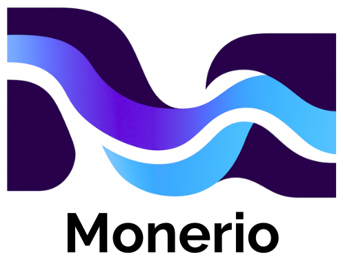
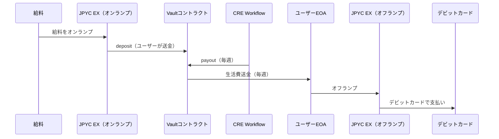
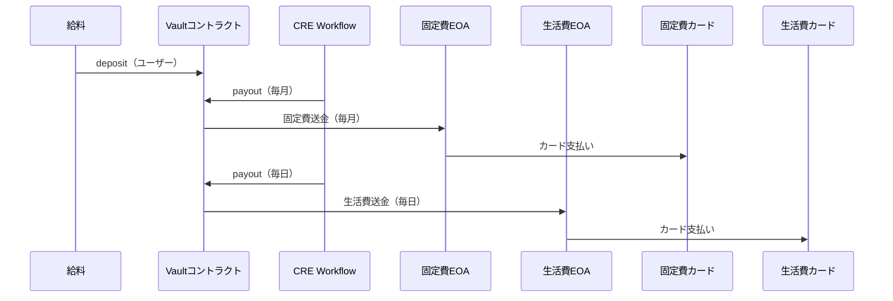
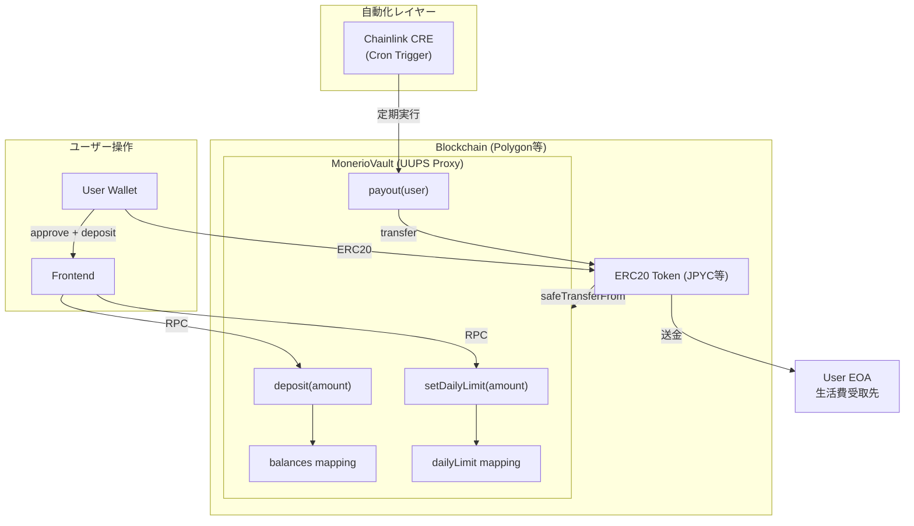

  

  
<strong>自動化された個人向け金融レイヤー</strong>

  

    
    
    
    
  

---

# 1. プロジェクト概要

**Monerio** は、ユーザーが一度資産を預けるだけで:

- 資産を安全に保管し
- 自動的に運用され（v2 以降）
- 必要な生活費のみ毎日または任意周期で EOA に送金され
- 将来的にはカード決済と連動し、使いすぎを防止できる

**自動化された個人向け金融レイヤー**を提供するプロジェクト。

---

# 2. 背景と課題

## 現代ユーザーの課題

- 資産運用の継続が難しい
- 生活費管理が困難
- カード決済の使いすぎ問題
- 銀行・家計簿アプリでは運用と予算管理が統合されていない

## 技術背景

スマートコントラクト、Chainlink CRE、AA Wallet により、

資産保管・運用・予算管理・自動支払いを統合した新しい金融モデルが実現可能となった。

---

# 3. Monerio が提供する価値

- 自動運用と自動送金の統合
- 必要資金のみを EOA に送金し使いすぎを防止
- 資産を Vault で安全に保管
- 将来的なカード連携による現実世界の支払い最適化
- 何もしなくても家計が最適化される体験

---

# 4. スコープ

## 本書で扱う

- Monerio のビジネス要件
- 機能要件・非機能要件
- v1 / v2 の定義
- フロー図およびシステム構成図

## 本書で扱わない

- 実装詳細（別途仕様書）
- CRE の TypeScript 実装
- 画面設計

---

# 5. バージョン定義

## 5.1 v1（JPYC EX 想定モデル）

### 目的

日本で確実に運用できる MVP を構築する。

### 想定フロー

### 提供機能

- deposit / payout
- dailyLimit 設定
- UUPS によるアップグレード
- CRE cron
- 家賃・光熱費の自動支払いなし
- カード連携なし

---

## 5.2 v2（Crypto カード / AA Wallet 対応モデル）

### 目的

Crypto デビット/クレカや AA Wallet と連動し、完全自動家計を実現する。

### 想定フロー

### 追加提供機能

- 家賃・光熱費の自動送金
- カード残高の自動チャージ
- 複数 EOA のカテゴリ管理
- DeFi 運用
- AA Wallet の自動支払い

---

# 7.システム構成図（Mermaid）

---

# 8. ロードマップ

## Phase 1（v1 / MVP）

- deposit / payout
- dailyLimit
- CRE cron
- JPYC EX 前提の設計

## Phase 2（v2）

- 家賃・光熱費自動送金
- カード残高自動管理
- DeFi 運用

## Phase 3

- AA Wallet による完全自動化
- Spend Policy のオンチェーン化