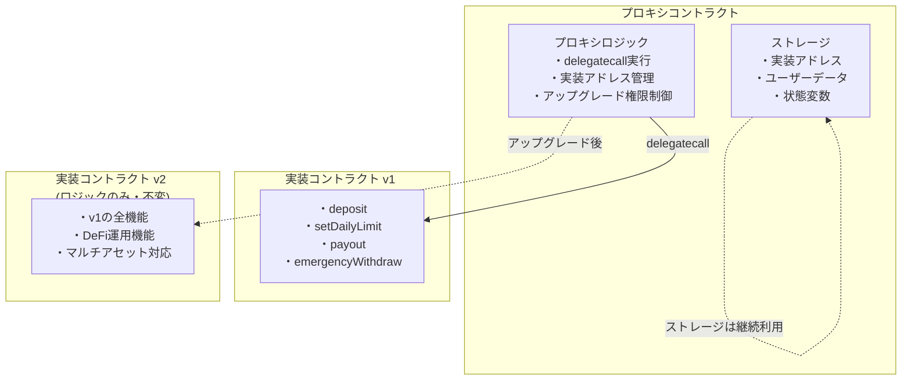
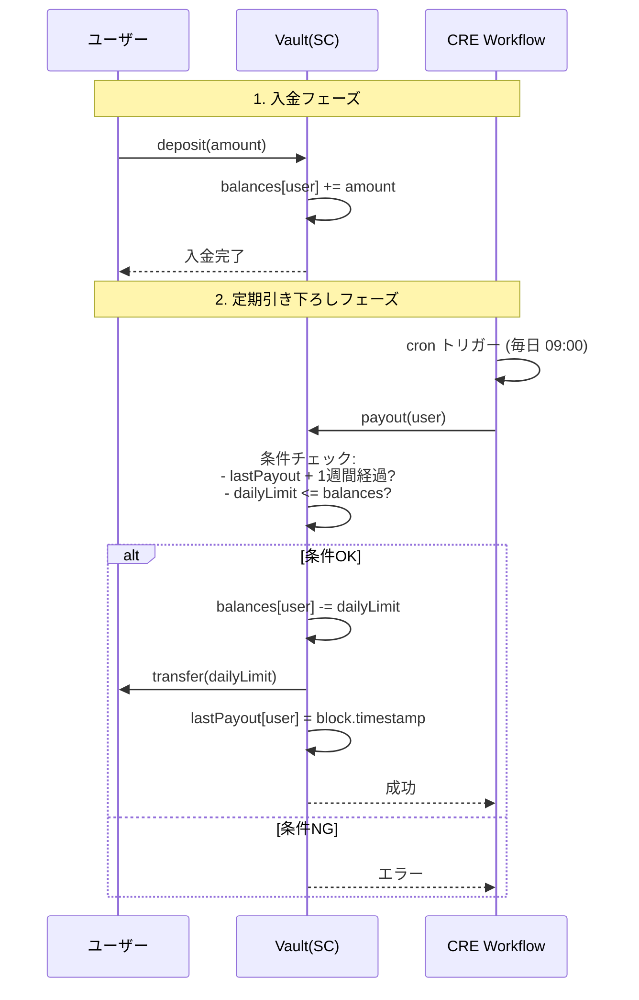

# スマートコントラクト仕様書

作成者: Kyoya
作成日時: 2025年11月29日 18:01
カテゴリー: v1.0
最終更新者: Kyoya
最終更新日時: 2025年11月29日 21:28

## 1. 概要

Monerio v1 のスマートコントラクトは以下の要素のみを対象とする：

- ユーザーが JPYC などの ERC20 トークンを Vault に預ける（deposit）
- Chainlink CRE が毎日または任意周期でユーザーへ送金する（payout）
- スマートコントラクトは「ユーザーごとの残高」「1週間の引き下ろし額」を保持
- 外部の資産運用（Aave / Uniswap 等）は **v2 以降で追加**
- コントラクトは **UUPS（ERC1967）方式でアップグレード可能** とする

**v1 の目的：**

"預けた資産から１週間ごとに一定額を自動的に引き下ろす仕組みを Onchain で安全に成立させる"

---

## 2. スマートコントラクト構造（Vault）

### 2.1 主要ステート変数

```solidity
IERC20 public token;
address public owner;

mapping(address => uint256) public balances;
mapping(address => uint256) public dailyLimit;
mapping(address => uint256) public lastPayout;

// 将来の変数追加のためのギャップ領域
uint256[50] private __gap;
```

---

## 3. アップグレード対応（UUPS / ERC1967）

本コントラクトは UUPS (Universal Upgradeable Proxy Standard) に基づき実装する。

### 3.1 必要な継承

```solidity
Initializable
UUPSUpgradeable
ReentrancyGuardUpgradeable
```

### 3.2 initialize（constructor 代替）

```solidity
function initialize(address token_) public initializer
```

- constructor は使用しない（Proxy では動かない）
- トークンアドレス・初期 owner を設定

### 3.3 アップグレード権限

```solidity
function _authorizeUpgrade(address newImpl)
    internal override onlyOwner {}
```

- owner のみアップグレード可能
- 将来的には Gnosis Safe や AccessControl に移行可

### 3.4 ストレージレイアウトの固定

- 変数の並び順を変更しない
- __gap により将来の追加を吸収

### 3.5 UUPS デプロイ構成



---

## 4. 関数一覧（v1）

### ▼ deposit

```solidity
function deposit(uint256 amount)
```

- ERC20 `transferFrom` により Vault に入金
- `balances[msg.sender] += amount`
- deposit 前にユーザーが Vault に対して allowance を与えている必要あり

---

### ▼ setDailyLimit

```solidity
function setDailyLimit(uint256 amount)
```

- 1週間の自動引き下ろし額を設定
- `dailyLimit[msg.sender] = amount`

---

### ▼ payout（CRE が毎周期で呼ぶ）

```solidity
function payout(address user)
```

処理フロー：

1. `block.timestamp >= lastPayout[user] + 1 days`
2. `dailyLimit[user] <= balances[user]`
3. `balances[user] -= dailyLimit[user]`
4. `token.transfer(user, dailyLimit[user])`
5. `lastPayout[user] = block.timestamp`

※ payout 呼び出しは誰でも可能だが、

必要であれば `onlyCRE` のような AccessControl を追加可能（v1では任意）

---

### ▼ emergencyWithdraw（管理者）

```solidity
function emergencyWithdraw(address to)
```

- owner のみに許可された緊急用途
- 保管資金の回収などに利用

---

## 5. Chainlink CRE Workflow 仕様（v1）

### 5.1 トリガー

- `cron.Trigger`
- 例：毎日 09:00 に起動

### 5.2 コールバックロジック

1. payout 対象ユーザー一覧を取得（固定、または offchain DB）
2. 各ユーザーに対して`evm.write -> payout(user)` を実行
3. 成功・失敗を CRE Logs に記録
4. Workflow 自体は stateless

---

## 6. 安全性

- ReentrancyGuard（入金・出金保護）
- 1週間1回の rate limit
- ERC20 `safeTransfer` を利用
- UUPS におけるストレージ衝突対策（__gap）
- owner 権限の悪用防止（将来的に Safe へ移行）

---

## 7. シーケンス図（定期引き下ろし v1）



---

## 8. MVP 範囲（v1）

- deposit / payout のみ実装
- dailyLimit の設定
- CRE による cron 実行
- UI は deposit & dailyLimit 設定のみで OK
- アップグレーダブル対応（UUPS）

---

## 9. 今後の拡張（v2〜）

- Aave/Uniswap 連携による自動運用
- マルチアセット対応
- カード連携（Slash / MetaMask / AA wallet）
- payout 条件の柔軟化（曜日・週・月）
- オンチェーンガバナンス
- CRE による運用最適化ロジック